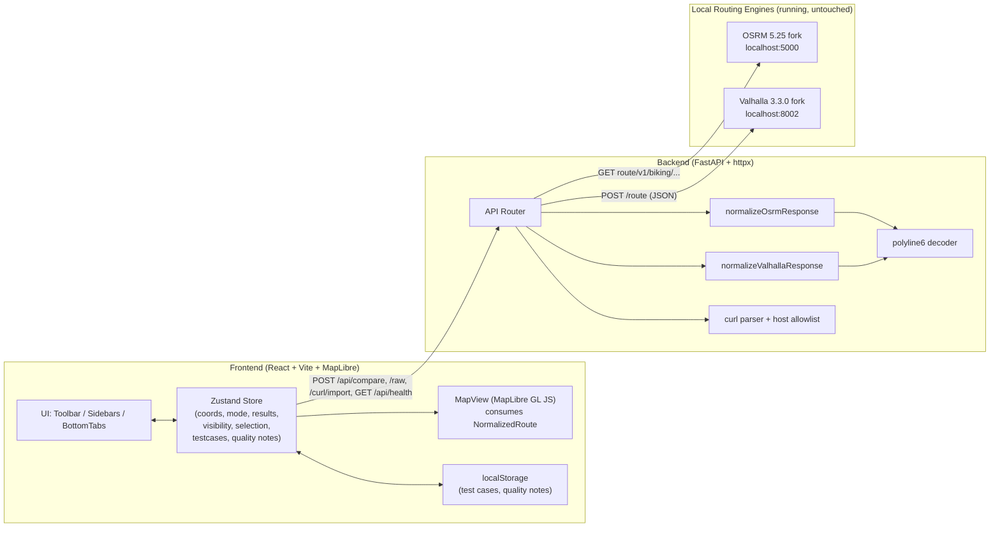

# Design Document

## Overview

The Bike Routing Comparison and Debugging Dashboard is a local engineering tool that queries two already-running routing engines — an OSRM 5.25 custom fork (`http://localhost:5000`, profile `biking`) and a Valhalla 3.3.0 custom fork (`POST http://localhost:8002/route`) — visualizes their route geometries on a map, and provides side-by-side comparison, raw request/response inspection, and route quality assessment.

The system is split into two processes:

- **Frontend** — React + TypeScript + Vite + MapLibre GL JS. Owns all UI, map rendering, application state, and localStorage persistence.
- **Backend** — Python + FastAPI + httpx. Acts as a proxy to the two engines. Its jobs are: (1) avoid browser CORS restrictions, (2) fan out the Compare action to both engines concurrently, (3) time each request, (4) normalize each engine response into the engine-agnostic `NormalizedRoute` model while preserving the full raw response, and (5) forward Advanced-mode raw requests and curl-imported requests, restricted to an allowlist of the two configured local hosts.

Version 1 has **no database**. Test cases and route quality notes persist in browser `localStorage` (Req 13, 14, 19.4). The dashboard **never modifies, rebuilds, restarts, or executes** any engine build/runtime command; it only calls the running HTTP services (Req 19).

Design intent: this is a debugging instrument for routing engineers. The priorities are fidelity (never hide or mutate engine output), isolation (one engine's failure never discards the other's results), and analytical clarity (distinguishable routes, precise numbers, full raw inspection). We deliberately keep v1 lean — no auth, no cloud, no containers, no arbitrary-URL executor.

### Key Design Decisions

| Decision | Choice | Rationale |
|---|---|---|
| Normalization + polyline6 decode location | Backend (Python) | `NormalizedRoute.coordinates` is produced by the backend `normalize*` functions (Req 12.1–12.3). Keeps engine-specific parsing in one place; frontend consumes a uniform model (Req 12.4). |
| Coordinate ordering in the model | `[lon, lat]` | Matches MapLibre/GeoJSON convention directly, so the frontend renders without re-ordering (Req 12.1). |
| Raw preservation | Full response carried verbatim in `raw` | Req 11.5–11.6, 11.1. Backend normalizes only render-critical fields and strips nothing. |
| Outbound host control | Static allowlist of `localhost:5000` and `localhost:8002` | Req 10.4, 19.1. No generic URL/shell executor is built. |
| Frontend state | Zustand store (single) | Lightweight, minimal boilerplate, selective subscriptions keep the map from re-rendering on unrelated state changes. |
| Engine fan-out | `asyncio.gather` with per-task isolation | Req 2.1–2.3, 17.13. Independent per-engine result envelopes. |

## Architecture



Request flow at a glance: the frontend never talks to the engines directly. It calls the backend, which enforces the host allowlist, forwards to the engines, times the round trip, normalizes, and returns a structured per-engine envelope. The map only ever sees `NormalizedRoute` values, so it is fully decoupled from engine response formats (Req 12.4).

## Components and Interfaces

### Frontend Component Breakdown

Mirrors the layout in Req 15.

```
App
├── Toolbar (Req 15.1)
│     ├── AppTitle
│     ├── CompareRoutesButton         → dispatches Compare (Req 2)
│     └── EngineHealthIndicators       → OSRM / Valhalla reachable? (Req 16)
├── LeftSidebar (Req 15.2)
│     ├── CoordinateInputs             → manual lat/lon start & dest (Req 1.1)
│     ├── MapControls                  → Set Start on Map / Set Dest on Map (Req 1.2–1.3)
│     ├── RequestOptions               → Normal/Advanced mode toggle (Req 9.1)
│     └── TestCases                    → Save/Load/Rename/Delete (Req 13)
├── MapView (Req 15.3)                 → MapLibre; markers, route layers,
│                                          click select, right-click context menu (Req 1,3,5,6)
├── RightSidebar (Req 15.4)
│     ├── RouteList (OSRM + Valhalla)  → per-route summary rows (Req 7)
│     ├── VisibilityControls           → per-route + bulk toggles (Req 5)
│     └── SelectedRouteInfo            → details of selected route (Req 6.6)
└── BottomTabs (Req 15.5)
      ├── ComparisonTab                → Comparison_Table (Req 8)
      ├── OSRMRawRequestTab            → Normal preview / Advanced editor / curl (Req 9,10)
      ├── OSRMResponseTab              → Raw_Response_Inspector (Req 11)
      ├── ValhallaRawRequestTab        → Normal preview / Advanced editor / curl (Req 9,10)
      ├── ValhallaResponseTab          → Raw_Response_Inspector (Req 11)
      └── AssessmentTab                → Route_Quality_Rating + notes (Req 14)
```

Engine-specific concerns (request building, parsing) are isolated from map rendering: the `MapView` consumes only `NormalizedRoute[]` plus visibility/selection state; it has no knowledge of OSRM or Valhalla response shapes (Req 12.4).

### Backend Modules

| Module | Responsibility |
|---|---|
| `app/main.py` | FastAPI app, CORS for the local dev frontend origin, router registration |
| `app/routes.py` | Endpoint handlers for `/api/compare`, `/api/osrm/raw`, `/api/valhalla/raw`, `/api/curl/import`, `/api/health` |
| `app/engines.py` | httpx client wrappers, per-engine call + timing + timeout, host allowlist enforcement |
| `app/normalize.py` | `normalize_osrm_response`, `normalize_valhalla_response` (Req 12.2–12.3) |
| `app/polyline.py` | `decode_polyline6` (Req 3.1–3.2) |
| `app/curlparse.py` | `parse_curl` using `shlex`, host validation (Req 10.2–10.4) |
| `app/models.py` | Pydantic request/response models |
| `app/config.py` | `ALLOWED_HOSTS`, engine base URLs, timeout constant |

## Data Models

### NormalizedRoute (Req 12.1)

The engine-agnostic route model produced by the backend and consumed by the frontend map.

```typescript
type Engine = "osrm" | "valhalla";

interface NormalizedRoute {
  id: string;              // stable: `${engine}:${index}`
  engine: Engine;
  index: number;           // 0 = primary, 1..n = alternates
  isPrimary: boolean;
  label: string;           // e.g. "OSRM Primary", "Valhalla Alt 2"
  coordinates: [number, number][]; // [lon, lat] pairs (MapLibre-ready)
  distanceMeters: number | null;
  durationSeconds: number | null;
  cost: number | null;     // OSRM weight / Valhalla summary.cost
  raw: unknown;            // the route's original engine object, unmodified
}
```

### Per-Engine Result Envelope (Req 2, 11, 17)

Each engine call returns an independent envelope so one engine's failure never affects the other (Req 2.2–2.3, 17.13).

```typescript
interface EngineResult {
  engine: Engine;
  status: "ok" | "error";
  httpStatus: number | null;      // engine HTTP status (Req 2.7)
  durationMs: number;             // measured round-trip time (Req 2.7, 7.1)
  normalizedRoutes: NormalizedRoute[];
  raw: unknown | null;            // full engine response, unmodified (Req 11.1)
  warnings: RouteWarning[];       // per-route normalization warnings (Req 17.10, 17.11)
  error: EngineError | null;
}

interface EngineError {
  kind: "unreachable" | "timeout" | "http_error"
      | "no_route" | "invalid_response" | "invalid_request";
  message: string;                // actionable (Req 17)
  detail?: unknown;
}

// A per-route normalization warning (e.g. a dropped malformed geometry) that
// does NOT fail the engine result. Mirrors the Route_Warning glossary term.
interface RouteWarning {
  engine: Engine;
  routeIndex: number;
  kind: string;                   // includes at least "geometry_error"
  message: string;                // actionable, identifies the affected route
}

interface CompareResponse {
  osrm: EngineResult;
  valhalla: EngineResult;
}
```

### Frontend App State (Zustand)

```typescript
interface AppState {
  // Coordinates (Req 1)
  start: { lat: number; lon: number } | null;
  dest:  { lat: number; lon: number } | null;
  mapClickTarget: "start" | "dest" | null; // armed by "Set X on Map"

  // Request construction (Req 9)
  mode: "normal" | "advanced";
  osrmUrlDraft: string;            // Advanced editable URL
  valhallaUrlDraft: string;
  valhallaBodyDraft: string;       // Advanced editable JSON body

  // Results (Req 2, 12)
  results: CompareResponse | null;
  routes: NormalizedRoute[];       // flattened from both envelopes

  // View state (Req 5, 6)
  visibility: Record<string, boolean>; // routeId -> visible
  selectedRouteId: string | null;

  // Persistence-backed (Req 13, 14)
  testCases: TestCase[];
  quality: Record<string, RouteQuality>; // key: testCaseId + routeId

  // Health (Req 16)
  health: { osrm: EngineHealth; valhalla: EngineHealth };
}

interface TestCase {
  id: string; name: string;
  start: { lat: number; lon: number };
  dest:  { lat: number; lon: number };
  notes?: string;
}

interface RouteQuality {
  rating: "good" | "bad" | "neutral";
  notes?: string;
}

type EngineHealth = "reachable" | "unreachable" | "unknown";
```

The store isolates engine-specific parsing (done in the backend) from rendering: the map subscribes only to `routes`, `visibility`, and `selectedRouteId` (Req 12.4).

## Backend API Design

All endpoints are JSON. The backend enforces the host allowlist (`localhost:5000`, `localhost:8002`) on every outbound request and refuses anything else (Req 10.4, 19.1). A shared timeout (~30s) applies to each engine call (Req 17.12).

### POST /api/compare (Req 2, 12)

**Normal mode only — canonical defaults only.** The request body contains **only** the start and destination coordinates. The backend **always** builds the fixed canonical `Default_OSRM_Request` and `Default_Valhalla_Request` itself from those coordinates and does **not** expose `osrmOptions`/`valhallaOptions` or accept any raw request material. It fans out to both engines concurrently, times each, and normalizes. It does **not** accept raw URL or raw body drafts — Advanced OSRM requests go through `POST /api/osrm/raw` and Advanced Valhalla requests through `POST /api/valhalla/raw` (Req 2.2–2.3). Parameter experiments belong to Advanced/raw mode, never to `/api/compare`.

Request:
```json
{
  "start": { "lat": 12.9, "lon": 77.6 },
  "dest":  { "lat": 12.95, "lon": 77.65 }
}
```

Canonical defaults the backend **always** applies (never client-supplied):

- **OSRM:** `overview=full`, `geometries=polyline6`, `alternatives=true`, `annotations=nodes,distance,duration,weight,speed,datasources`, `steps=true`.
- **Valhalla:** `costing="motorcycle"`, `alternates=10`, `shape_format="polyline6"`, `directions_options.units="kilometers"`.

Response: `CompareResponse` (see Data Models). Each side is computed independently via `asyncio.gather(..., return_exceptions=True)`; an exception on one task is converted to that engine's `error` envelope and never aborts the other (Req 2.4–2.5, 17.13).

### POST /api/osrm/raw (Req 9.4–9.5)

Sends **exactly** the OSRM URL the user entered — no parameter regeneration.
```json
{ "url": "http://localhost:5000/route/v1/biking/77.6,12.9;77.65,12.95?overview=full&geometries=polyline6&alternatives=true&steps=true" }
```
Backend validates the host is `localhost:5000`, issues `GET`, times it, normalizes, returns a single `EngineResult`.

### POST /api/valhalla/raw (Req 9.6–9.7)

Sends **exactly** the user's URL + JSON body verbatim — no default substitution of `costing` or other options.
```json
{ "url": "http://localhost:8002/route", "body": { "locations": [...], "costing": "motorcycle", "alternates": 10, "shape_format": "polyline6" } }
```
Host must be `localhost:8002`. Returns a single `EngineResult`.

### POST /api/curl/import (Req 10)

Parses a pasted curl command with `shlex` (never a shell), extracts method/URL/headers/body, validates the host against the allowlist, maps the URL to OSRM vs Valhalla, and executes the forwarded request.
```json
{ "curl": "curl -X POST 'http://localhost:8002/route' -H 'Content-Type: application/json' -d '{...}'" }
```
Response: `{ "engine": "osrm"|"valhalla", "result": EngineResult }`. If the host is not allowlisted, responds `400` with an actionable message and executes nothing (Req 10.4, 17.7).

### GET /api/health (Req 16)

Health means **HTTP service reachability, not a 2xx status.** The backend issues a lightweight root probe to `localhost:5000` (OSRM) and `localhost:8002` (Valhalla) with a short timeout:

- If the probe returns **any** HTTP response — including `4xx`/`404`/`400` — the engine is `reachable`. A 404/400 from a root probe does **not** mean the engine is down (Req 16.1, 16.2, 16.4).
- If the connection is **refused**, the request **fails**, or it **times out**, the engine is `unreachable` (Req 16.3).

```json
{ "osrm": "reachable"|"unreachable", "valhalla": "reachable"|"unreachable" }
```
An unreachable engine is reported as `unreachable`, never as a backend error, so the dashboard stays usable (Req 16.5).

## Engine Normalization

Both normalizers preserve the entire original response and only extract the render-critical fields (Req 11.6, 12.2–12.3). Unknown/custom fields (`turn_id`, `from_linkId_idx`, `to_linkId_idx`, `from_node_idx`, `to_node_idx`, annotations `nodes/distance/duration/weight/speed/datasources`) are never stripped — they live in each route's `raw` and in the envelope's top-level `raw` (Req 11.5).

### normalizeOsrmResponse (Req 12.2, 3.1, 7.2)

- If `code != "Ok"` (e.g. `"NoRoute"`), return zero `normalizedRoutes` and set `error.kind = "no_route"` while still preserving `raw` (Req 17.8).
- If `routes` is missing or empty, treat as no route (Req 17.8).
- `routes[0]` → primary (`index 0`, `isPrimary true`); `routes[1..]` → alternates. Zero alternates is valid: only the primary is produced (Req 17.9).
- Per route: `distanceMeters = route.distance` (already meters), `durationSeconds = route.duration` (seconds), `cost = route.weight`.
- Geometry: `route.geometry` is a polyline6 string → `decode_polyline6` → `[lon, lat][]`.
- Missing individual fields map to `null`, not errors (Req 7.4).

### normalizeValhallaResponse (Req 12.3, 3.2, 7.3)

- On an error response (Valhalla returns `{ "error": ..., "error_code": ... }`), return zero routes with `error.kind = "no_route"` (or `invalid_response`), preserving `raw` (Req 17.8).
- `response.trip` → primary; `response.alternates[i].trip` → alternates. Missing/absent `alternates` → only primary (Req 17.9).
- Summary is on `trip.summary`. **Distance units are unit-aware, never permanently assumed to be kilometers.** The normalizer determines the actual units from the Valhalla response — preferring `trip.units` when present, otherwise falling back to the request's `directions_options.units` context — and defaults to kilometers only if nothing indicates otherwise. It then converts: kilometers → meters by `* 1000`, miles → meters by `* 1609.344`. `distanceMeters` is **always** meters. `durationSeconds = summary.time` (seconds); `cost = summary.cost` (Req 7.3). Note that `Default_Valhalla_Request` sends `units="kilometers"`, but Advanced_Mode may send `"miles"`, so unit handling must read the response/context rather than hard-coding kilometers.
- Geometry (multi-leg): decode each `trip.legs[*].shape` polyline6 string **independently**, then concatenate the decoded legs in order. When joining, avoid duplicating the shared boundary coordinate: if the last coordinate of the accumulated shape equals the first coordinate of the next leg within a small tolerance (e.g. `1e-6`), skip that duplicate first coordinate of the next leg. A single-leg route is the simple/normal case (decode one shape, no join needed).
- Missing fields → `null` (Req 7.4).

Because the two engines can report distance in different units, the model always converts to and stores `distanceMeters` (meters) after unit-aware conversion. The comparison table's "vs Primary" percentages are therefore computed on a single consistent unit (Req 8.2).

## polyline6 Decoding

Both engines emit **polyline6** (precision `1e6`) for geometry (Glossary; Req 3.1–3.2). Decoding is done in the **backend (Python)** because `NormalizedRoute.coordinates` is produced by the backend normalizers (Req 12.1–12.3); this keeps all engine-specific handling in one place and hands the frontend a uniform, render-ready model (Req 12.4).

### Coordinate ordering (critical)

Three different orderings are in play and must not be confused:

| Context | Ordering |
|---|---|
| OSRM request URL | `lon,lat` (e.g. `77.6,12.9;77.65,12.95`) |
| Valhalla request `locations` JSON | separate `lat` / `lon` fields, `type: "break"` |
| Google/OSRM/Valhalla polyline decode output | latitude first, then longitude |
| MapLibre / GeoJSON (our `coordinates`) | `[lon, lat]` |

The standard polyline algorithm yields `(lat, lon)` pairs. The decoder therefore **swaps to `[lon, lat]`** on output so the result is directly consumable by MapLibre (Req 12.1).

### Algorithm

Standard Google-polyline variable-length + zig-zag decoding at factor `1e6`:

```python
def decode_polyline6(encoded: str) -> list[list[float]]:
    coords, index, lat, lon = [], 0, 0, 0
    factor = 1e6
    n = len(encoded)
    while index < n:
        for is_lon in (False, True):
            result, shift = 0, 0
            while True:
                b = ord(encoded[index]) - 63
                index += 1
                result |= (b & 0x1f) << shift
                shift += 5
                if b < 0x20:
                    break
            delta = ~(result >> 1) if (result & 1) else (result >> 1)
            if is_lon:
                lon += delta
            else:
                lat += delta
        coords.append([lon / factor, lat / factor])  # [lon, lat] for MapLibre
    return coords
```

A malformed geometry string (truncated/undecodable) raises a decode error that the normalizer catches per route: that route is dropped, the engine result keeps `status="ok"` (when it otherwise succeeded), the full raw response is preserved, and a `geometry_error` `RouteWarning` (with the route's `engine` + `routeIndex`) is appended so the Frontend can surface it. Other routes continue unaffected (Req 17.10, 17.11).

## Map Rendering & Layer / Hit-testing Strategy

### Source & layer model

Use **one combined GeoJSON source** (`routes`) — a single `FeatureCollection` containing **all** OSRM and Valhalla route features. The source is configured with **`promoteId: "routeId"`**: every feature carries `properties.routeId` (e.g. `"osrm:0"`, `"valhalla:2"`), and MapLibre promotes that value to the feature's id. Each `Feature`:

- Carries `properties: { routeId, engine, index, isPrimary, color }`. The feature identity comes from `properties.routeId` promoted to the feature id via `promoteId`, so `map.setFeatureState` targets a feature by passing its `routeId` value as the id. Engines are distinguished purely via each feature's `color` property (blue family for OSRM, warm family for Valhalla).
- Has geometry `LineString` built from `NormalizedRoute.coordinates`.

Note: `selected` and `visible` are **not** stored in feature properties — they are tracked via MapLibre `feature-state` (see below). Only `color` lives in properties.

Rendering uses **three global layers** over that one source, stacked to control z-order (Req 6.4). **All three layers share the same source features** — none of them uses a `filter`; per-layer visibility is driven entirely by paint expressions reading `feature-state`:

1. `routes-hit` — transparent wide line (see hit-testing) — bottom, for clicks only.
2. `routes-base` — visible routes, normal width, reduced opacity when a selection exists (Req 6.5).
3. `routes-selected` — contains the **same** source features as the other layers (**not** filtered by feature-state — MapLibre feature-state cannot be used in a layer `filter`). Its paint expressions read `feature-state.selected` and `feature-state.visible`: when `selected && visible` it draws with the normal selected line width and `line-opacity` 1; otherwise `line-opacity` is `0` (and its width collapses effectively to `0`), so only the selected + visible feature is visibly drawn by this layer. It is added **last** so it is the highest route line layer. Whichever engine's route is selected therefore always draws above all other routes, regardless of engine (Req 6.4).

Per-feature color, width, and opacity are driven by MapLibre **data-driven expressions** reading `properties.color` and the `feature-state` flags `visible`/`selected`, so toggling visibility/selection updates paint properties without rebuilding the source.

Layer order overall (bottom → top): `routes-hit` → `routes-base` → `routes-selected`. All three layers render the same combined source features; `routes-selected` visibly shows only the selected + visible feature via its `feature-state`-driven paint expressions (no filter). This guarantees the selected route always draws above overlapping routes from either engine (Req 6.4).

### Visibility & selection via feature-state (Req 5, 6)

Both **visibility** and **selection** are tracked via MapLibre `feature-state` keyed by the feature id promoted from `properties.routeId` (via `promoteId: "routeId"`), set through `map.setFeatureState` using that `routeId` value as the id:

- `feature-state.visible` — toggled by per-route and bulk visibility controls.
- `feature-state.selected` — set on the currently selected feature (cleared on the previous one).

Paint expressions read these states (no layer uses a `filter`). The `routes-base` layer uses a `line-opacity` expression that collapses to `0` when `visible` is false. The `routes-selected` layer shares the same source features as the others and is **not** filtered; its paint expressions draw a feature only when `selected && visible` (normal selected width, `line-opacity` 1) and otherwise set `line-opacity` to `0` and collapse its width effectively to `0`, so exactly the selected + visible feature is visibly drawn. **Hidden routes must also be non-hit-testable:** the `routes-hit` layer uses a `line-width` paint expression that returns `0` when a feature's `visible` feature-state is false, so hidden routes have effective hit width `0` and cannot be clicked.

Bulk controls (Show All, Hide All, OSRM Only, Valhalla Only, Primary Only, Alternatives Only) are pure state transforms that update the `visible` feature-state across features (Req 5.3–5.8). "Render only the number of routes actually returned" falls out naturally because features exist only for returned routes (Req 3.5).

### Color assignment (Req 4)

- OSRM → **blue family**; Valhalla → **red/warm family** (Req 4.1–4.2).
- Colors are generated by rotating **HSL hue** within each family's hue band and modulating lightness/saturation so adjacent routes stay distinguishable on both light and dark basemaps (Req 4.3).
- Primary uses the family's anchor hue; alternates step the hue by a fixed increment. When an engine returns more routes than expected, additional distinct colors are generated by continuing the HSL rotation within the family band (Req 4.4).

```typescript
// OSRM band ~ hue 200–260 (blues), Valhalla band ~ hue 0–40 (reds/oranges)
function routeColor(engine: Engine, index: number): string {
  const band = engine === "osrm" ? { h0: 210, span: 50 } : { h0: 5, span: 40 };
  const hue = band.h0 + (index * 23) % band.span;      // rotate, wrap in band
  const light = 45 + (index % 2) * 12;                 // alternate lightness
  return `hsl(${hue}, 75%, ${light}%)`;
}
```

### Click hit-testing for overlapping routes (Req 6.1)

Map clicks resolve to exactly one route even when lines overlap:

1. The transparent `routes-hit` layer uses a wide `line-width` (~12–16px) to create clickable padding around thin route lines — reduced to `0` for features whose `visible` feature-state is false, so hidden routes are never hit.
2. On click, call `queryRenderedFeatures(point, { layers: ['routes-hit'] })` against the single hit layer.
3. If multiple features are returned, pick deterministically: prefer the currently selected route if present in the set, otherwise the **topmost rendered** feature (first in the query result). Break remaining ties by a stable order (`engine` then ascending `index`) so repeated clicks are reproducible.
4. Set `selectedRouteId` to the chosen feature's `routeId` (its promoted feature id).

Selection can also come from the RouteList and the Comparison table rows (Req 6.2–6.3); all three paths funnel through the same `selectRoute(routeId)` store action.

## Map Presentation & Fitting

Covers Requirement 20: a detailed road basemap and automatic framing of the relevant geometry.

### Auto-fit and manual fit (Req 20.1–20.3)

- **After a successful Compare**, the map auto-fits to the combined bounds of all valid returned routes: compute the bounding box over every `NormalizedRoute.coordinates` of the returned routes and call `map.fitBounds(bounds, { padding: … })` (Req 20.1).
- A manual **"Fit Routes"** toolbar/map control triggers the exact same fit routine, so engineers can re-frame at any time (Req 20.2).
- **Fallback when no routes exist:** if only start and/or destination markers are present, fit to those marker coordinates instead (a padded bounds around the markers, or a sensible zoom on a single marker) (Req 20.3).

The fit routine is a single shared function parameterized by the set of coordinates to frame (route coordinates when routes exist, else marker coordinates), so Compare-triggered and manual fits share one implementation.

### Basemap style (Req 20.4)

- The map uses a **detailed OpenStreetMap-based MapLibre style that requires no API key** — a pragmatic default is a **raster style built from OSM raster tiles** (e.g. the standard OSM tile server), which needs no token and gives road-level detail suitable for route inspection.
- The **style/basemap is configurable** via a config value / environment variable (e.g. `VITE_MAP_STYLE_URL`). Raster OSM tiles are the no-key default; because the style URL is configurable, a vector style (or any alternative MapLibre style) can be swapped in without code changes.

### Default view (Req 20.5)

- When **no route and no coordinates** exist, the map centers on the **Delhi NCR region** (approx. `lat 28.6139, lon 77.2090`) at a sensible default zoom, so the engineer opens onto a useful area rather than a world view.

## Curl Import Safety

Curl import must extract a request without ever invoking a shell (Req 10.3).

- **Tokenize with `shlex.split`**, which parses quoting/escaping the way a shell would *lex* it, but performs **no execution**. This safely handles quoted URLs and quoted JSON bodies.
- Extract from tokens: `-X`/`--request` → method; the bare URL token (or `--url`); repeated `-H`/`--header` → headers; `-d`/`--data`/`--data-raw`/`--data-binary` → body (Req 10.2).
- **Validate the host against the allowlist** (`localhost:5000`, `localhost:8002`). Any other host → reject with an actionable error and execute nothing (Req 10.4, 17.7).
- **Map to engine by URL**: path under `/route/v1/` on `:5000` → OSRM; `:8002/route` → Valhalla.
- Reject clearly if no URL is found, the command isn't a `curl` invocation, or the body isn't valid JSON for a Valhalla POST (Req 17.7).

The parser only ever produces a structured request that is then run through the same allowlisted httpx path as the raw endpoints. There is no generic arbitrary-URL executor and no shell execution anywhere (Req 10.3, 19).

## Frontend State Management

**Choice: a single Zustand store.** Compared to React Context + reducer, Zustand offers selective subscriptions (the map re-renders only when `routes`/`visibility`/`selectedRouteId` change, not when a test-case name is edited) with minimal boilerplate, which matters for a MapLibre view. This keeps engine-specific parsing (backend) fully separated from rendering (map consumes `NormalizedRoute` only, Req 12.4).

Core state is defined in Data Models. Notable behaviors:

- **Coordinate changes** regenerate the Normal-mode OSRM/Valhalla request previews (Req 1.8) via a derived selector, not stored duplicated strings.
- **Compare** (Normal mode only — Advanced requests use the raw endpoints) sets `results`, flattens envelopes into `routes`, initializes `visibility`/`selected` feature-state to all-visible for returned routes only (Req 3.5, 5), surfaces any per-engine `warnings` (e.g. `geometry_error`) in the UI, and auto-fits the map to the returned routes (Req 20.1).
- **Persistence**: `testCases` and `quality` are mirrored to `localStorage` on change and hydrated on load (Req 13.3, 14.3–14.4). Loading a test case restores coordinates and regenerates previews but does **not** auto-send — it waits for an explicit Compare (Req 13.4–13.5).
- **Health** is refreshed via `GET /api/health` on startup and on demand; `unknown`/`unreachable` never blocks app usage (Req 16.3).

## Error Handling

Errors are handled per engine and per route so that a failure is always isolated and actionable (Req 17). The backend converts every failure into a structured `EngineError` on that engine's envelope; the frontend maps each kind to a clear message and never discards the other engine's valid results (Req 17.13).

| Condition | Requirement | Where handled | Behavior |
|---|---|---|---|
| Engine unreachable (connection refused) | 17.1, 17.2, 16.2 | Backend engine call | Envelope `status="error"`, `kind="unreachable"`, `httpStatus=null`; health indicator shows unreachable; other engine unaffected. |
| Engine returns HTTP error status (4xx/5xx) | 17.3 | Backend engine call | Envelope `kind="http_error"`, `httpStatus` set; frontend shows status + actionable message; `raw` preserved. |
| Invalid coordinates (out of range / missing) | 17.4 | Frontend validation before send | Show validation error; **no** request sent (lat∈[-90,90], lon∈[-180,180]). |
| Invalid JSON body (Advanced Valhalla) | 17.5 | Frontend validation before send | Show JSON error; **no** request sent. |
| Invalid raw request (Advanced) | 17.6 | Frontend validation before send | Show error; **no** request sent. |
| Invalid curl input | 17.7, 10.4 | Backend curl parser | Reject (400) with actionable message; **nothing** executed; non-allowlisted host explicitly rejected. |
| NoRoute (OSRM `code!="Ok"` / Valhalla error) | 17.8 | Backend normalizer | Zero routes, `kind="no_route"`; frontend shows no-route message for that engine; `raw` preserved. |
| Zero alternates | 17.9 | Backend normalizer | Only primary produced; frontend renders primary and notes "no alternatives returned". |
| Malformed route geometry | 17.10, 17.11 | Backend normalizer (per route) | Drop **only** the malformed route; **keep `status="ok"`** when the engine otherwise succeeded; preserve the **full raw** response; append a `geometry_error` `RouteWarning` identifying the affected route (`engine` + `routeIndex`). The Frontend displays these warnings (in the route list / summary / assessment area). Remaining valid routes are still returned/rendered. |
| Request timeout (~30s) | 17.12 | Backend engine call | `kind="timeout"`; frontend shows timeout error for that engine; other engine unaffected. |
| One engine errors, other succeeds | 17.13, 2.2, 2.3 | Backend fan-out + frontend | Independent envelopes; valid engine's routes retained and displayed. |

The backend fan-out uses `asyncio.gather(osrm_task, valhalla_task, return_exceptions=True)`; any exception is caught and converted to that engine's error envelope, guaranteeing the sibling result is always returned (Req 2.2–2.3, 17.13).

## Correctness Properties

*A property is a characteristic or behavior that should hold true across all valid executions of a system — essentially, a formal statement about what the system should do. Properties serve as the bridge between human-readable specifications and machine-verifiable correctness guarantees.*

These properties were derived from the acceptance-criteria prework and consolidated to remove redundancy. Each is a candidate for a single property-based test (minimum 100 iterations).

### Property 1: polyline6 round-trip

*For any* list of `[lon, lat]` coordinates within valid geographic range, encoding it to polyline6 and then decoding it SHALL reproduce the original coordinates within a tolerance of `1e-6`, with output ordered as `[lon, lat]`.

**Validates: Requirements 3.1, 3.2**

### Property 2: Normalization count invariant

*For any* engine response **in which all returned route geometries are valid/decodable**, the number of `NormalizedRoute` values produced SHALL equal the number of routes actually returned by that engine (OSRM `routes` length; Valhalla `1 + alternates` length), with exactly one primary; when zero alternates are returned, exactly the primary SHALL be produced. Omission of malformed routes is out of scope for this property and is covered separately by Property 7 (per-route malformed-geometry isolation).

**Validates: Requirements 3.3, 3.4, 3.5, 8.3, 17.9**

### Property 3: Valhalla unit conversion

*For any* Valhalla trip summary and its resolved distance units (from `trip.units`, else the `directions_options.units` context, else kilometers), the normalized `distanceMeters` SHALL equal `summary.length * 1000` when units are kilometers and `summary.length * 1609.344` when units are miles, `durationSeconds` SHALL equal `summary.time`, and `cost` SHALL equal `summary.cost`. `distanceMeters` SHALL always be expressed in meters.

**Validates: Requirements 7.3**

### Property 4: Raw response preservation

*For any* engine response object containing arbitrary custom or unknown fields (including `turn_id`, `from_linkId_idx`, `to_linkId_idx`, `from_node_idx`, `to_node_idx`, and annotations `nodes/distance/duration/weight/speed/datasources`), the preserved `raw` SHALL deep-equal the original response with no field dropped or mutated.

**Validates: Requirements 11.1, 11.5, 11.6**

### Property 5: NormalizedRoute structural invariant

*For any* engine response, every produced `NormalizedRoute` SHALL have `coordinates` as `[lon, lat]` pairs with `lon ∈ [-180,180]` and `lat ∈ [-90,90]`, an `engine` of `"osrm"` or `"valhalla"`, a boolean `isPrimary` true exactly when `index == 0`, and `distanceMeters/durationSeconds/cost` each either a number or `null`.

**Validates: Requirements 12.1**

### Property 6: No-route handling

*For any* OSRM response with `code != "Ok"` or Valhalla response carrying an error, normalization SHALL yield zero routes and an error envelope of kind `no_route`, while still preserving the full `raw` response.

**Validates: Requirements 17.8**

### Property 7: Per-route malformed-geometry isolation

*For any* engine response containing one route with an undecodable polyline6 geometry among otherwise valid routes, normalization SHALL return all valid routes and omit only the corrupt one without raising, SHALL keep the engine result status as `ok` (when the request otherwise succeeded), SHALL preserve the full raw response, and SHALL emit a `geometry_error` `RouteWarning` identifying the affected route by `engine` and `routeIndex`.

**Validates: Requirements 17.10, 17.11**

### Property 8: Error isolation between engines

*For any* pair of per-engine outcomes (success, HTTP error, unreachable, timeout, or exception), each engine's result envelope SHALL be independent — a failure on one engine SHALL NOT remove, alter, or null the other engine's routes or status.

**Validates: Requirements 2.2, 2.3, 17.13**

### Property 9: Error classification totality

*For any* engine failure (raised exception or non-2xx status), the engine call SHALL produce an error envelope with the correct `EngineError.kind` (`unreachable`, `timeout`, `http_error`, `no_route`, or `invalid_response`) and SHALL NOT throw.

**Validates: Requirements 17.1, 17.2, 17.3, 17.12**

### Property 10: Host allowlist decision

*For any* URL, curl import and raw forwarding SHALL be accepted exactly when the target host is in the allowlist (`localhost:5000` or `localhost:8002`) and SHALL be rejected — executing nothing — for every other host.

**Validates: Requirements 10.4, 19.1**

### Property 11: Verbatim raw forwarding

*For any* Advanced-mode OSRM URL on an allowed host, the outbound URL SHALL equal the input exactly; and *for any* Advanced-mode Valhalla JSON body, the forwarded body SHALL deep-equal the input (no default substitution of `costing` or other options).

**Validates: Requirements 9.5, 9.7**

### Property 12: Default OSRM request construction

*For any* valid start and destination coordinates, the generated Normal-mode OSRM request URL SHALL place coordinates in `lon,lat;lon,lat` order and contain all default parameters `overview=full`, `geometries=polyline6`, `alternatives=true`, `annotations=nodes,distance,duration,weight,speed,datasources`, and `steps=true`.

**Validates: Requirements 9.2, 9.3**

### Property 13: Coordinate validation

*For any* latitude/longitude pair, validation SHALL pass if and only if latitude is in `[-90, 90]` and longitude is in `[-180, 180]` and both are present; an invalid pair SHALL NOT produce an engine request.

**Validates: Requirements 17.4**

### Property 14: Comparison vs-primary computation

*For any* per-engine set of routes, each route's "Distance vs Primary" and "Duration vs Primary" SHALL equal `(value - primaryValue) / primaryValue` computed against **that route's own engine** primary; the primary route's own diff SHALL be `0`; and a primary value of `0` SHALL be handled without producing an invalid (NaN/Infinity) result.

**Validates: Requirements 8.2**

### Property 15: Color family band membership

*For any* route index, the color generated for an OSRM route SHALL have a hue within the blue family band and for a Valhalla route within the warm family band.

**Validates: Requirements 4.1, 4.2**

### Property 16: Color distinctness

*For any* `N` in `1..32` routes for a single engine (the practical supported range), the `N` generated colors SHALL be pairwise distinct. Distinctness is guaranteed only within this bounded range, not for arbitrary unbounded `N`.

**Validates: Requirements 4.4**

### Property 17: Bulk visibility partition

*For any* set of returned routes, each bulk visibility control SHALL produce exactly its defined partition of the visibility map — Show All → all visible; Hide All → all hidden; OSRM Only → visible iff `engine=="osrm"`; Valhalla Only → visible iff `engine=="valhalla"`; Primary Only → visible iff `isPrimary`; Alternatives Only → visible iff `not isPrimary`.

**Validates: Requirements 5.3, 5.4, 5.5, 5.6, 5.7, 5.8**

### Property 18: Hit-test determinism

*For any* set of candidate route features returned for a map click, the tie-break resolution SHALL return the same `routeId` on repeated evaluation (preferring an already-selected route, otherwise the topmost feature, with a stable `engine`-then-`index` tie-break).

**Validates: Requirements 6.1**

### Property 19: Persistence round-trip

*For any* test case (and its associated quality rating/notes), saving it to `localStorage` and then reloading SHALL return an equal value.

**Validates: Requirements 13.3, 14.3, 14.4**

## Testing Strategy

The dashboard uses a **dual approach**: property-based tests for universal correctness of the pure logic layer, plus example/integration tests for UI, wiring, and external-service behavior. We retain strong coverage for the correctness-critical pure functions: polyline6 decoding, OSRM & Valhalla normalization (including unit conversion and multi-leg geometry dedup), coordinate ordering, malformed-geometry isolation and the emitted `geometry_error` warning, raw response preservation, request generation, curl safety/host allowlisting, error isolation, and comparison math. Property-based testing is appropriate for these because they are pure functions with large input spaces.

**Pragmatism (Req 20 testing note / NFR):** property-based tests are valuable for these pure functions but **MUST NOT block delivery of a working dashboard**. Ordinary unit and integration tests are acceptable — especially for UI behavior. The PBT tagging/iteration guidance below still applies, but PBT for the correctness-critical pure logic is the **priority, not a gate on shipping**. UI rendering, map paint/z-order configuration, fit-bounds behavior, and engine reachability are **not** PBT candidates and use example/snapshot/integration tests instead.

### Property-Based Tests

- **Backend (Python):** use **Hypothesis**. Cover Properties 1–14 (polyline6 round-trip, normalization count/structure/units, raw preservation, no-route, geometry isolation, error isolation/classification, host allowlist, verbatim forward, default request build, coordinate validation, vs-primary diff). Generators produce synthetic OSRM/Valhalla response shapes (varying route/alternate counts, missing fields, extra custom fields, corrupt geometry) and arbitrary coordinates/URLs/hosts.
- **Frontend (TypeScript):** use **fast-check**. Cover Properties 12–19 that live in the frontend (color family/distinctness, bulk visibility partition, hit-test determinism, persistence round-trip, coordinate validation, vs-primary diff if computed client-side).
- Configuration: each property test runs a **minimum of 100 iterations**.
- Each property test is tagged with a comment referencing its design property, format: **Feature: bike-routing-dashboard, Property {number}: {property_text}**.
- Each correctness property is implemented by a **single** property-based test.
- Do **not** implement PBT from scratch — use Hypothesis / fast-check.

### Example / Unit Tests

- Per-engine status/duration/HTTP-code rendering (Req 2.4, 2.5).
- Comparison table columns and row-click selection (Req 8.1, 8.4).
- Selected-route rendering: `routes-selected` layer added last, paint expressions branch on the `selected` feature-state (Req 6.4–6.6).
- Map fitting: after Compare, `fitBounds` frames all valid routes; the "Fit Routes" control re-fits; with only markers, it fits to markers; default view centers on Delhi NCR (Req 20.1–20.3, 20.5).
- Per-route warnings surfaced in the UI: a `geometry_error` `RouteWarning` is displayed for the affected route while the engine result stays `ok` (Req 17.10, 17.11).
- Raw inspector: pretty-print, collapsible, copy control, error display (Req 11.2–11.4).
- Curl safety example: input containing `$(...)`/backticks is tokenized by `shlex`, never executed, no side effects (Req 10.3).
- Advanced-mode guards: invalid JSON / invalid raw block the send with an error (Req 17.5, 17.6); invalid/non-curl input rejected (Req 17.7).
- Test-case load restores coordinates and regenerates previews but does not auto-Compare (Req 13.4, 13.5).
- Quality rating/notes assignment and display (Req 14.1, 14.2).

### Integration Tests (mocked engines)

- Compare fan-out calls both engines concurrently (Req 2.1).
- Health check treats any HTTP response (including 404/400) as reachable and only connection-refused/failure/timeout as unreachable; the app stays usable while an engine is unreachable (Req 16.1–16.5).
- End-to-end Compare with mocked OSRM + Valhalla responses producing a full `CompareResponse`.

These tests use 1–3 representative examples and mocks rather than many iterations, because they exercise external-service wiring and UI, where input variation adds little.
